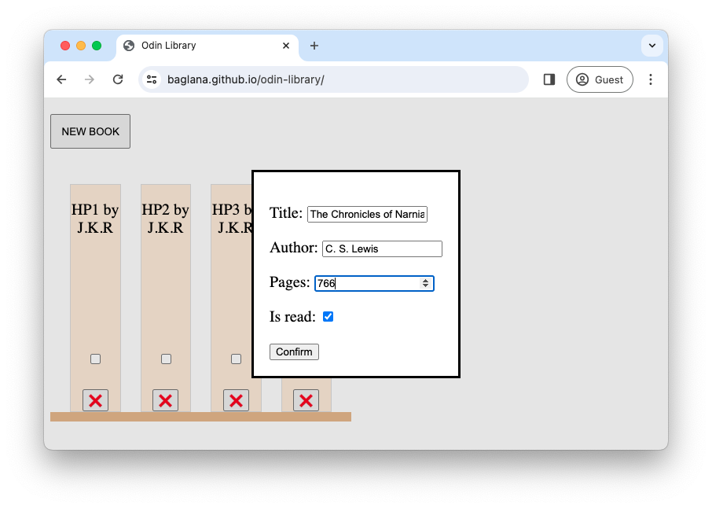
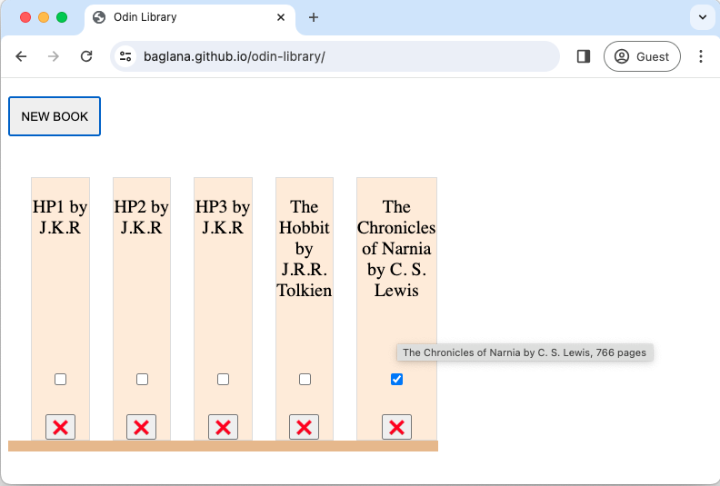
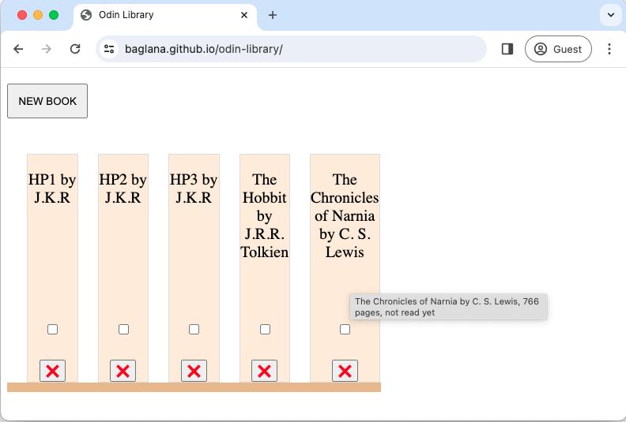
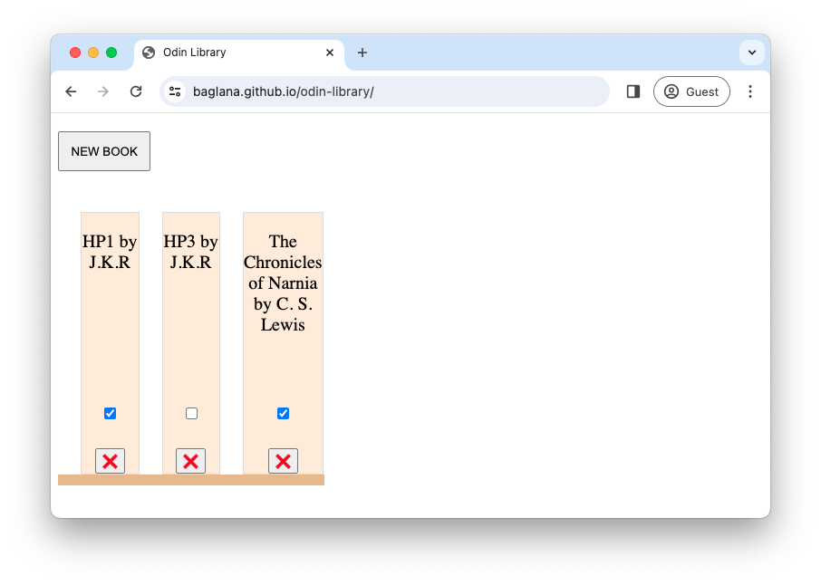

# odin-library

A project to practice object constructors and classes

- Live Demo URL: [baglana.github.io/odin-library/](baglana.github.io/odin-library/)

## Features:

- Pressing the 'NEW BOOK' button will show the modal dialog box with a form to enter new book details and confirming will add new book the the shelf

- Hovering over a book shows its information including title, author, pages (if specified), and read status (if not read)

- Clicking a checkbox on each book toggles its read status

- Pressing a button with a cross sign on each book will remove it from the shelf (page reload will bring back default books and manually added books will be lost)
